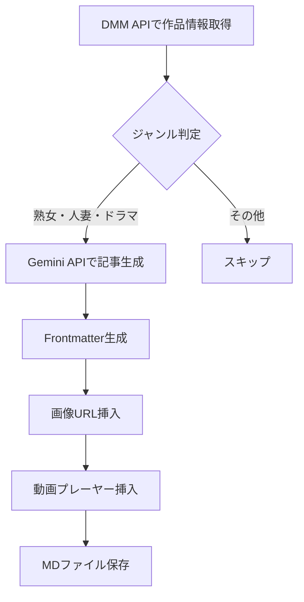

# 熟女・人妻・ドラマ専門ブログ 要件定義書

## 1. プロジェクト概要

### 1.1 サイトコンセプト
熟女・人妻・ドラマ作品に特化した、官能小説のような雰囲気を持つアダルトコンテンツレビューブログ。  
**「大人の女性の魅力」**を映画レビューのような視点で語り、女性読者も楽しめるラグジュアリーなサイトを目指す。

### 1.2 ターゲット読者
- **メイン**: 30代〜50代の男性（熟女・人妻作品を好む層）
- **サブ**: 女性読者（官能小説的な表現、うっとりするような文章を好む層）
- **共通**: ストーリー性や演技力を重視し、単なるエロではなく「作品」として楽しむ視聴者

### 1.3 差別化ポイント
- 熟女・人妻・ドラマ作品に完全特化
- 官能小説のような表現で、うっとりするような読後感
- 女性も楽しめる品のあるデザインと文章
- 映画レビューのようなストーリー分析と演技評価

---

## 2. 扱うジャンル（必須条件）

### 2.1 対象ジャンル
以下のいずれかに該当する作品のみを扱う：

1. **熟女作品**
   - 30代以上の女優が出演する作品
   - 大人の女性の色気や包容力が魅力
   
2. **人妻作品**
   - 人妻・主婦設定の作品
   - 背徳感、禁断の関係がテーマ
   
3. **ドラマ作品**
   - ストーリー性の高い作品
   - シチュエーション設定が明確な作品
   - NTR、不倫、近親相姦などのドラマ性のある作品

### 2.2 除外ジャンル
以下のジャンルは扱わない：
- 企画もの（素人ナンパ、マジックミラー号など）
- ハード系（SM、スカトロなど）
- 若い女優のみの単体作品（ドラマ性がない場合）
- ギャル系、コスプレのみを売りにした作品

---

## 3. 記事執筆ガイドライン

### 3.1 執筆スタイル

#### 3.1.1 トーン＆マナー
- **官能小説的な表現**: 直接的すぎず、想像力を掻き立てる表現
- **うっとりするような文章**: 余韻を残す、詩的な表現を心がける
- **品のある言葉遣い**: 下品な表現は避け、洗練された言葉を選ぶ
- **映画レビューのような視点**: ストーリー構成、演出、演技を分析

#### 3.1.2 語り口
```
❌ NG例（従来のスタイル）:
「マジでヤバいｗ」「抜けるわｗ」「これ見てないやつは損してる」

✅ OK例（新スタイル）:
「この作品は、大人の女性の色気を存分に堪能できる一本です」
「彼女の演技は、見る者の心を静かに揺さぶります」
「物語は、禁断の関係を繊細に描き出しています」
```

#### 3.1.3 禁止事項
- 批判・悪口は一切禁止
- 下品な表現、スラング（「ｗ」「マジで」「ヤバい」など）の使用禁止
- 直接的すぎる性描写（品のある範囲で表現する）
- 女優への失礼な表現

### 3.2 記事構成

#### 3.2.1 基本構成
```markdown
## [詩的なタイトル]
（「心を揺さぶる、禁断の物語」「大人の色気が香り立つ一本」など）

## [作品名]
（パッケージ画像 + アフィリエイトリンク）

**出演:** [女優名]
**ジャンル:** [ジャンル]
**メーカー:** [メーカー名]
**監督:** [監督名]

## 作品との出会い
（作品を観た第一印象を、官能小説のように語る）
（「この作品に出会ったのは〜」「彼女の佇まいに心奪われた」など）

## 物語の魅力
（ストーリーの構成、設定、展開を映画レビューのように分析）
（ネタバレしない範囲で、物語の核心に迫る）

## 演技と演出の妙
（女優の演技力、表情、仕草を具体的に評価）
（監督の演出、カメラワーク、音楽などの要素も言及）

## 心に残るシーン
（特に印象的だったシーンを、官能小説的に描写）
（サンプル画像を4-5枚配置）

## この作品を観るあなたへ
（読者への語りかけで締めくくる）
（「この作品は、あなたに新しい発見をもたらすでしょう」など）
```

#### 3.2.2 文字数
- 最低2,500文字以上
- 各セクションを丁寧に展開
- 具体的な描写と分析を含める

### 3.3 表現ガイドライン

#### 3.3.1 推奨表現
- 「色気」「艶めき」「妖艶」「官能」「余韵」
- 「心を揺さぶる」「うっとりする」「魅了される」
- 「禁断の」「秘密の」「背徳的な」
- 「大人の女性ならではの」「成熟した」「洗練された」

#### 3.3.2 描写のバランス
- **ストーリー**: 40%（物語の構成、テーマ、メッセージ）
- **演技**: 30%（女優の演技力、表情、仕草）
- **演出**: 20%（監督の演出、カメラワーク、照明）
- **シーン描写**: 10%（具体的なシーンの描写）

---

## 4. サイトデザイン

### 4.1 デザインコンセプト
- **ラグジュアリー**: 高級感のあるデザイン
- **うっとりする**: 余白を活かした、落ち着いた雰囲気
- **女性も楽しめる**: 下品さを感じさせない、洗練されたUI

### 4.2 デザイン要素

#### 4.2.1 カラーパレット
```css
/* 推奨カラー */
- メインカラー: 深みのある赤紫、ワインレッド（#8B2252, #722F37）
- アクセントカラー: ゴールド、シャンパンゴールド（#D4AF37, #F0E68C）
- 背景: アイボリー、ベージュ系（#FFF8E7, #F5F5DC）
- テキスト: チャコールグレー、深い茶色（#2F2F2F, #3E2723）
```

#### 4.2.2 タイポグラフィ
- **見出し**: 明朝体、セリフ体（優雅で読みやすい）
- **本文**: ゴシック体とのバランスを取り、可読性を重視
- **行間**: 1.8〜2.0（余白を活かす）
- **文字サイズ**: 16px以上（読みやすさ優先）

#### 4.2.3 レイアウト
- 余白を多めに取る
- カード型レイアウトで作品を上品に配置
- 画像は控えめなサイズで品よく表示
- ホバーエフェクトは滑らかに

#### 4.2.4 画像表示
- パッケージ画像は角丸、シャドウで柔らかく
- サンプル画像はギャラリー形式で品よく配置
- 画像サイズは控えめ（露骨すぎない）

### 4.3 UI/UX

#### 4.3.1 ナビゲーション
- シンプルで分かりやすい構造
- 「熟女」「人妻」「ドラマ」のカテゴリー分け
- 年代別、女優別、メーカー別の絞り込み

#### 4.3.2 記事ページ
- 読書体験を重視したレイアウト
- アフィリエイトリンクは控えめに配置
- 関連作品の提案を自然に

#### 4.3.3 女性読者への配慮
- 露骨な表現は避ける
- プライバシーに配慮した表示
- 「官能小説を読む」ような体験を提供

---

## 5. 技術仕様

### 5.1 使用API

#### 5.1.1 DMM API
- **用途**: 作品情報の取得
- **取得データ**:
  - 作品タイトル
  - 品番（content_id）
  - 女優名
  - ジャンル
  - メーカー
  - 監督
  - 発売日
  - パッケージ画像URL
  - サンプル画像URL
  - 商品説明（あらすじ）
  - アフィリエイトURL

#### 5.1.2 Gemini API
- **用途**: 記事本文の生成
- **モデル**: gemini-2.5-flash
- **プロンプト設計**:
  - ペルソナ: 「官能小説家」「映画評論家」のハイブリッド
  - トーン: 品のある、うっとりするような表現
  - フォーカス: ストーリー性、演技力、演出

### 5.2 記事生成フロー



### 5.3 ファイル構成

```
/content/
  └── YYYY-MM-DD-{contentId}.md  # 記事ファイル

/scripts/
  ├── fetch_mature_drama_works.py  # 熟女・人妻・ドラマ作品を取得
  ├── generate_mature_drama_article.py  # 記事生成
  └── validate_genre.py  # ジャンル判定

/components/
  ├── MatureDramaCard.tsx  # 作品カード
  ├── ElegantLayout.tsx  # ラグジュアリーレイアウト
  └── FeminineDesign.tsx  # 女性向けデザイン要素
```

### 5.4 Frontmatter仕様

```yaml
---
title: "作品タイトル"
date: "YYYY-MM-DD"
excerpt: "作品の魅力を簡潔に"
image: "パッケージ画像URL"
tags: ["熟女", "人妻", "ドラマ", "女優名", "メーカー"]
affiliateLink: "アフィリエイトURL"
contentId: "品番"
rating: 4.5
genre: ["熟女", "人妻", "ドラマ"]  # 必須ジャンル
actressAge: "30代"  # 女優の年代
storyScore: 4.5  # ストーリー評価
actingScore: 5.0  # 演技評価
atmosphereScore: 4.0  # 雰囲気評価
---
```

---

## 6. 記事生成プロンプト設計

### 6.1 ペルソナ設定

```
あなたは、官能小説家と映画評論家の両方の視点を持つ、洗練されたレビュアーです。
熟女・人妻・ドラマ作品の魅力を、品のある言葉で語ります。

【特徴】
- 大人の女性の色気や演技力を繊細に表現する
- ストーリーの構成や演出を映画レビューのように分析する
- 読者がうっとりするような、余韻を残す文章を書く
- 女性読者も楽しめる、品のある表現を心がける
```

### 6.2 記事生成時の制約

```
【必須条件】
- 熟女・人妻・ドラマのいずれかに該当する作品のみを扱う
- 批判・悪口は一切禁止
- スラング（「ｗ」「マジで」「ヤバい」）は使用しない
- 直接的すぎる性描写は避ける

【推奨表現】
- 官能小説的な表現（「艶めく」「妖艶」「色気」など）
- 映画レビュー的な分析（「演出の妙」「カメラワーク」など）
- 詩的な表現（「心を揺さぶる」「余韻を残す」など）

【文字数】
- 最低2,500文字以上
- 各セクションを丁寧に展開
```

### 6.3 ジャンル判定ロジック

```python
def is_valid_genre(product_info: dict) -> bool:
    """
    熟女・人妻・ドラマに該当するかを判定
    """
    genres = product_info.get("genre", [])
    actress_list = product_info.get("actress", [])
    
    # ジャンルチェック
    valid_genres = ["熟女", "人妻", "ドラマ", "NTR", "不倫", "近親相姦"]
    has_valid_genre = any(g in valid_genres for g in genres)
    
    # 女優の年齢チェック（30代以上）
    # ※ DMM APIには年齢情報がないため、データベース参照が必要
    
    return has_valid_genre
```

---

## 7. 実装ロードマップ

### Phase 1: 基盤構築（1-2週間）
- [ ] DMM APIで熟女・人妻・ドラマ作品を取得するスクリプト作成
- [ ] ジャンル判定ロジックの実装
- [ ] Gemini APIプロンプトの設計と調整

### Phase 2: 記事生成（1週間）
- [ ] 記事生成スクリプトの作成
- [ ] サンプル記事の生成と品質チェック
- [ ] Frontmatterの調整

### Phase 3: デザイン実装（2-3週間）
- [ ] ラグジュアリーなデザインの実装
- [ ] カラーパレット、タイポグラフィの調整
- [ ] レスポンシブ対応

### Phase 4: コンテンツ充実（継続）
- [ ] 初期記事の生成（50-100本）
- [ ] 記事品質の継続的な改善
- [ ] ユーザーフィードバックの収集

---

## 8. KPI・成功指標

### 8.1 コンテンツKPI
- 記事数: 100本以上（3ヶ月）
- 平均文字数: 2,500文字以上
- 記事品質スコア: 4.0以上（5段階評価）

### 8.2 ユーザーKPI
- 平均滞在時間: 3分以上
- 直帰率: 60%以下
- ページ/セッション: 2.5以上

### 8.3 収益KPI
- アフィリエイトクリック率: 5%以上
- コンバージョン率: 1%以上

---

## 9. 参考・インスピレーション

### 9.1 デザイン参考
- 高級ホテルのウェブサイト
- ファッション・ビューティー系メディア
- 官能小説サイト

### 9.2 文章参考
- 映画レビューサイト（Filmarks、映画.comなど）
- 官能小説（渡辺淳一、林真理子など）
- 文芸誌のレビュー記事

---

## 10. 注意事項

### 10.1 コンプライアンス
- アダルトコンテンツである旨を明記
- 18歳未満の閲覧を制限
- プライバシーポリシー、利用規約の整備

### 10.2 著作権
- DMM APIの利用規約を遵守
- 画像の使用は規約の範囲内
- 引用元の明記

### 10.3 品質管理
- 定期的な記事の見直し
- ユーザーフィードバックの反映
- デザインの継続的な改善

---

## 改訂履歴
- 2025-12-30: 初版作成

